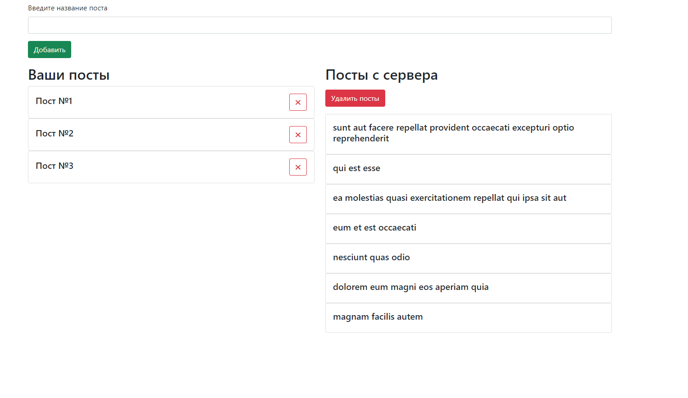
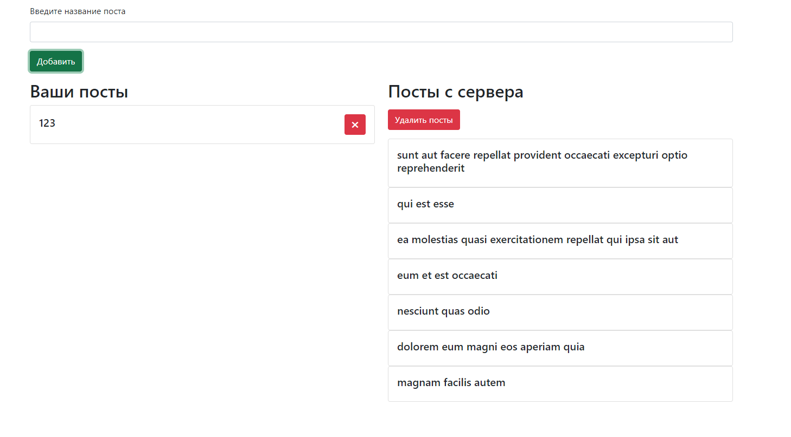
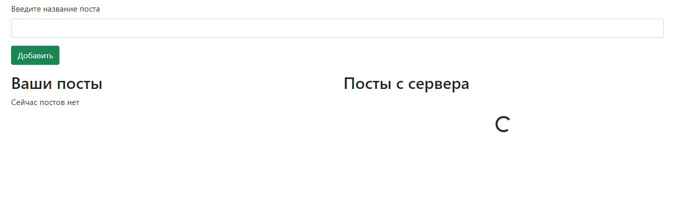
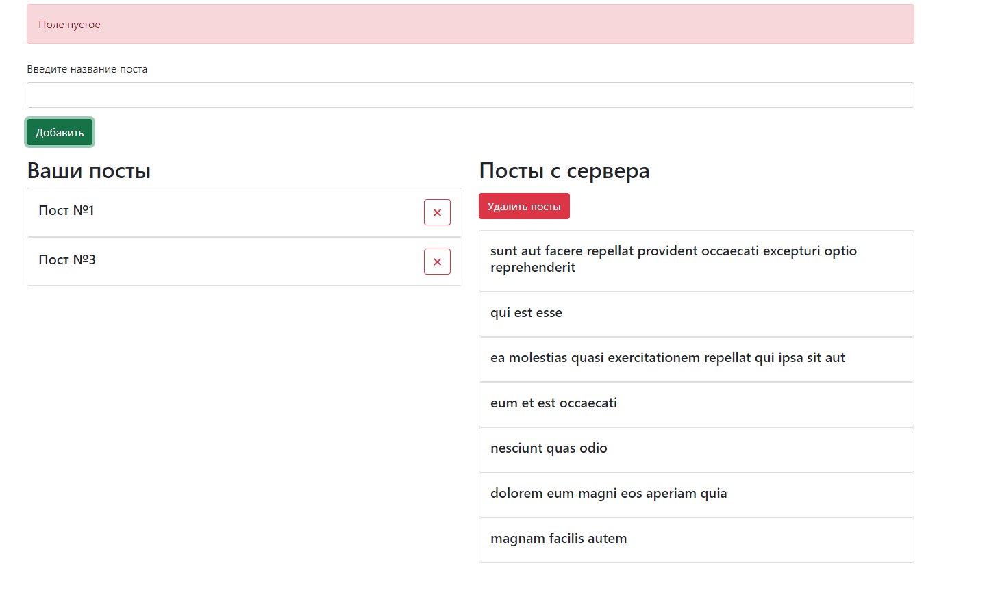
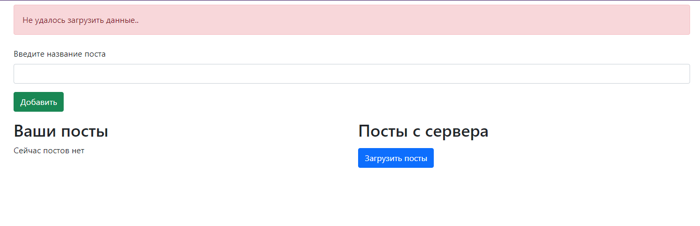
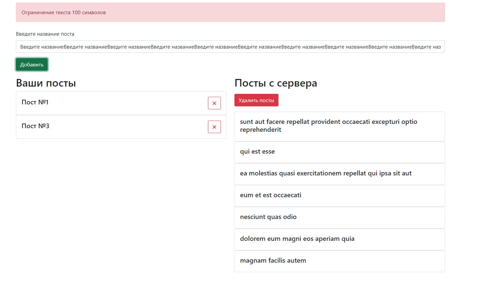

## Работа с постами React/Redux/Saga
***

***
#### Описание: 
##### Были отработаны основные используемые технологии связки React + Redux, такие как :
***

* Middleware
* Thunk
* Hooks
* mapStateToProps
* mapDispatchToProps
* Fetch
* Saga
***
##### Реализовано добавление/удаление данныхgit init

***
##### Присутствует loader при загрузке данных с сервера JSONPlaceholder

***

##### Обработанны ошибки при вводе и загрузке данных с сервера:
***

***

***

